# 034 基于Web的航空航天数字博物馆推荐系统-设计展示

> **代码有偿获取 可接受定制 微信联系方式: csbysj2020 或 ACE2487，备注(BS)**

> 

> 

## 介绍

该系统是一个基于Web开发的航空航天数字博物馆推荐系统，使用Python的Django框架和Vue.js的Element Plus组件库、WindiCSS、Pinia、Vue Router等技术进行开发。该系统为用户提供了展品展示、分类筛选、个性化推荐等功能，帮助用户更好地了解航空航天领域的知识和文化，丰富用户的参观体验。

在首页轮播图方面，系统提供了后台配置功能，管理员可根据展览需求进行轮播图的修改和更新。同时，系统还提供了中国飞机类别的筛选功能，包括无人机、教练机、运输机、预警机、水上飞机、民用飞机、轰炸机、直升机、歼击机等不同类型，让用户更加方便快速地找到自己感兴趣的展品信息。

为了提高用户的参观效果，系统还提供了个性化推荐功能，用户可以填写自己的信息，包括昵称、性别、年龄、从事劳动类型、对航天的了解度以及参加数字博物馆的目的等，系统可以据此推荐符合用户兴趣爱好的展品。同时，系统还支持对展品进行评分，管理员可以在后台管理展品信息，对展品的类别、评分等数据进行修改。

总之，该系统为用户提供了全面的航空航天数字博物馆展品服务，同时也满足了用户个性化推荐的需求，让用户能够更好地了解和体验数字博物馆。

## 技术栈

python django vue element-plus windicss pinia vue-router  
首页轮播图，可以在后台进行配置  
中国飞机类别筛选，无人机 歼击机 运输机 预警机 教练机 水上飞机 民用飞机 轰炸机 直升机  
飞机展品个性化推荐  
填写用户信息，昵称、性别、年龄、从事劳动类型、对航天的了解度、参加数字博物馆目的  
飞机详细信息，类别、访问量、创建及修改时间，可对飞机进行评分，并推荐相关的展品  
后台管理飞机信息，类别，评分等数据  

## 视频

> **点击查看 \>\>\> [https://www.bilibili.com/video/BV1CM4y1q7du/](https://www.bilibili.com/video/BV1CM4y1q7du/)**

## 截图

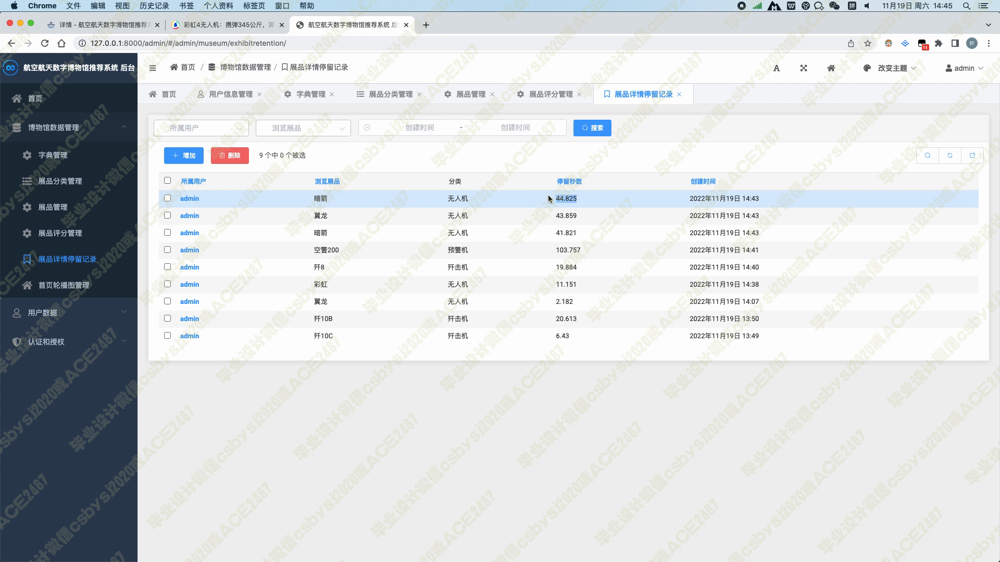
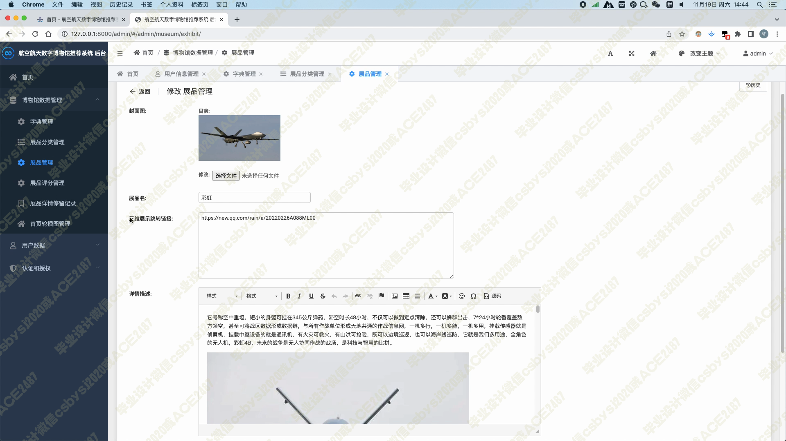
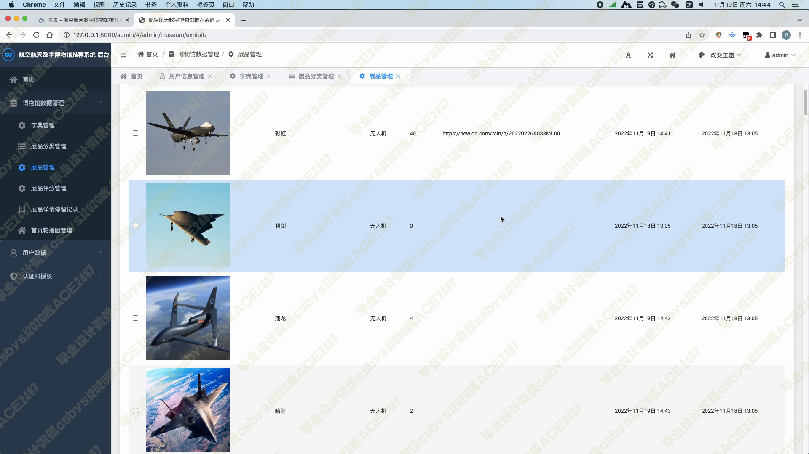

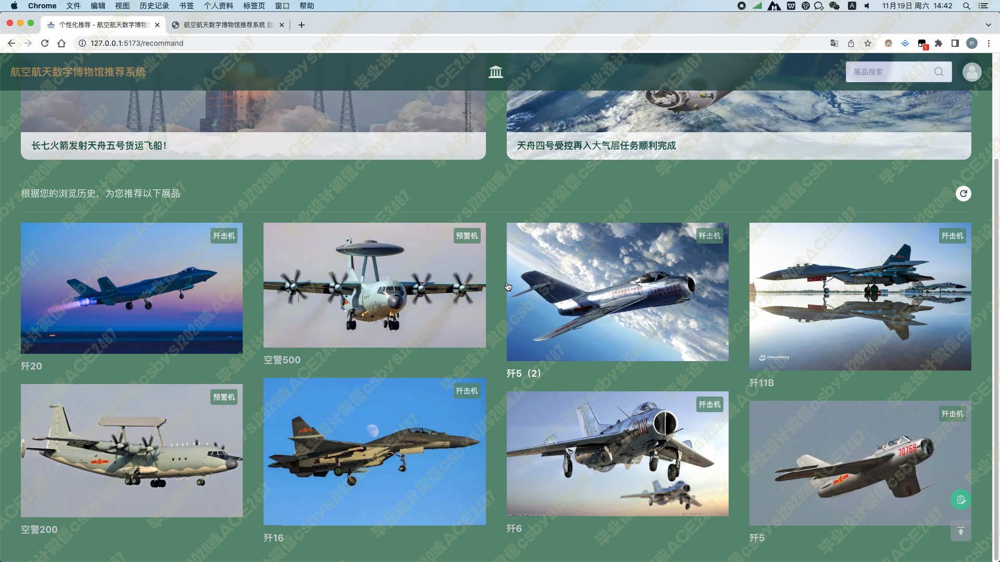
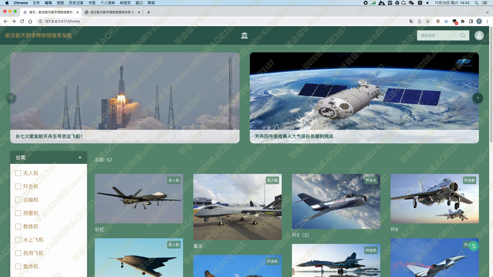

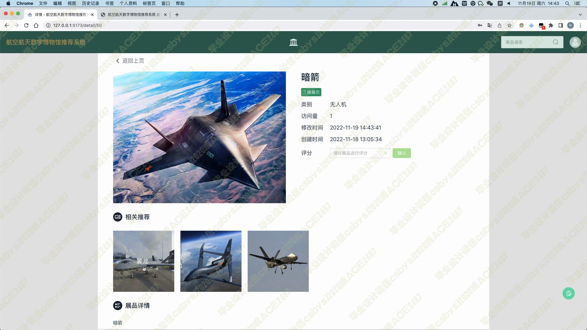
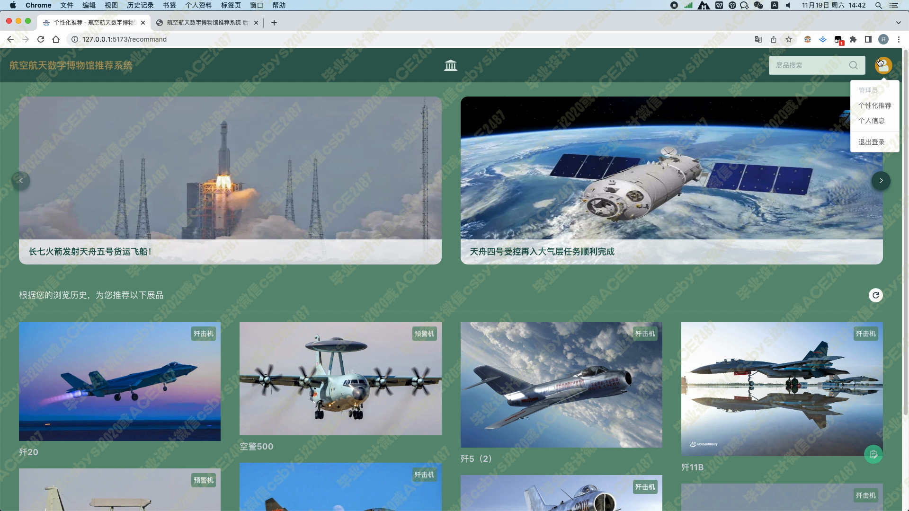
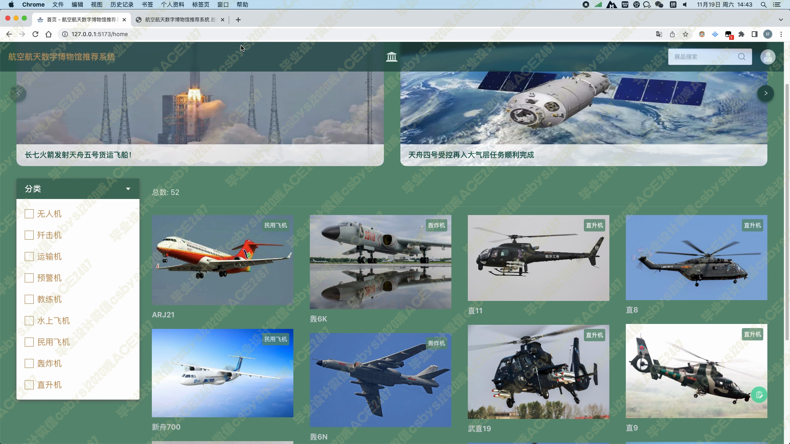
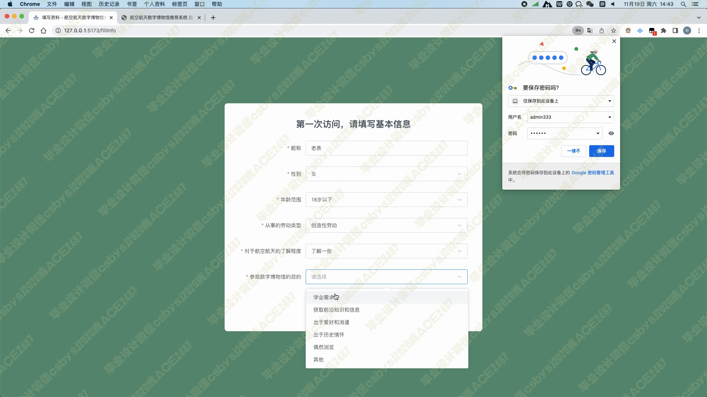
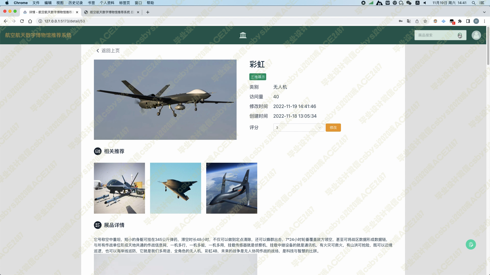
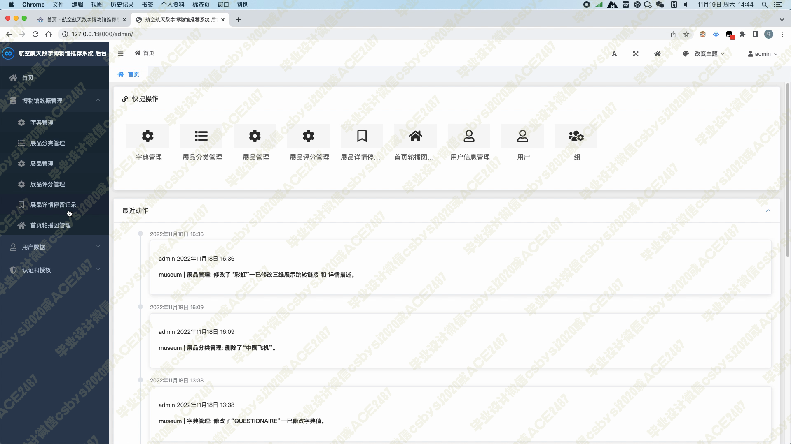
